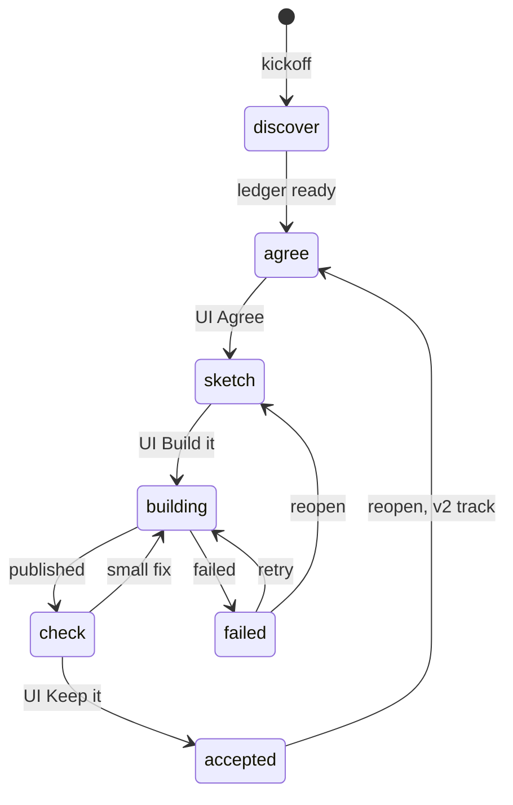

# Process optimization: two agent identities, authority in code

Exploration, 2026-09-22. Spec v3 after two review rounds with gpt-6-astra. The
living copy is the "Agent Identities Spec" doc; this file is the repository
record. Nothing here is implemented yet; the order of work at the end is the
plan.

## Why change

One identity with an ~18k-token prompt (base + instructions.md + process.md +
capabilities.md + an inlined interview skill) and the full toolbox in every
phase. Measured on a live discovery conversation on the production host:

| Measure | Value |
|---|---|
| Turns | 11 |
| Model calls | 37 |
| Calls per turn | 3.4 |
| Tokens | 442k |
| Model latency per turn | ~17 s |
| Latency per call | 4 to 5 s |

A raw call to the same model from a laptop takes 7 to 12 s including client
overhead, so the app adds nothing per call. The cost is the number of calls:
the intent file rewritten after every answer, files re-inspected after the
kickoff declared them empty, the restatement and the question in two calls,
and one prose question instead of a card seen in production.

Diagnosis: behaviour is enforced by prompt. A rule the model can break, it
breaks some of the time. A rule enforced by what is mounted and by a
controller that checks the output, it cannot.

## The Colleague

The one person-facing identity for the life of the app: one voice, one
transcript. It interviews, agrees, sketches, relays the build, and checks.

- **Prompt per render.** `colleague.md` (identity: voice, plain-language and
  secrecy rules, USE vs BUILD, the card protocol, the one-app rule; at most
  450 words), then one line `Current step: N — label`, then the body of
  `steps/N-*.md`, then only the paragraphs of `capabilities.md` marked for
  that step. Nothing else. Target: under 4k tokens in step 1, under 8k
  elsewhere.
- **Tools.** Decided by the state table in code, never by the prompt or the
  step file. Step 1 mounts `ask_user` alone.
- **Model.** Step 1 runs the `discovery` role (GPT-5.6 Terra, low effort).
  Every other state runs the `default` role (gpt-6-astra, medium). Roles come
  from `src/model-roles.ts` and are overridable by environment. `useModel` is
  called once per render with the resolved pair.
- **State it reads.** The step, the facts ledger, the revision records
  (fiche, mockup, approvals). It writes nothing itself; tools write.
- **Never.** App code, publishing, a state change except through the tools
  the state mounts, a file outside the state's canonical-path allowlist.

## The Builder

A fresh-context Flue subagent that never talks to the person. Code invokes it
from the `build` tool through a harness prompt; the model never composes its
brief.

- **Input, the entire briefing.** The fiche at its approved immutable hash,
  the mockup path and hash, the acceptance lines, the base app version,
  `app/docs/PRODUCT.md`, the kit reference, and a build capability.
- **Prompt.** `builder.md`: build only the agreement, `scaffold_app` for a
  fresh kit, additive migrations, `kit.md` for screens, publish the complete
  tree, the five delivery checks, never report an unobserved success.
- **Tools.** File tools over `/code`, `scaffold_app`, `publish`, `versions`,
  `logs`, `view_app_console`, `view_app_screenshot`, and the app's own
  `app_*` tools after publish. No `ask_user`, no `show`. The sandbox is
  just-bash over an in-memory virtual filesystem with no host processes and
  no network; canonical-path checks still apply to the file tools.
- **Model.** The `build` role: gpt-6-astra or GPT-5.6 Sol at high effort.
- **Output.** A report `{ version, checks: [{line, status, evidence}],
  unresolved[], notes }`, validated by code. The deployed version and the
  observed checks are read from runtime-owned records (the hub's version
  list, the meter's tool events), never trusted from the report. A lost final
  message never triggers a second deploy.

## Step files

A step file carries guidance and nothing else. `seed/agent/steps/N-<name>.md`
has two front-matter fields, `step` and `label`, and a body that holds only
that step's guidance, moved from `process.md` and `instructions.md`.

- Editable through edit-yourself like the other agent files. The text is
  snapshotted into the conversation's state when the step is entered, so a
  later edit never rewrites a running step.
- No tools, models, gates, or transitions in files. Those are code, so an
  edit cannot grant the interview a shell or skip a gate.
- An invalid or missing step file fails the render with a legible error.
- Five files match the five steps the person sees. Tuning the interview
  means editing `1-discover.md` and nothing else.

## States, tools, and transitions

Seven states, decided in a code table. The person still sees five steps;
`building`, `failed`, and `accepted` are internal.

| State | Mounted tools | Enters by | Leaves by |
|---|---|---|---|
| 1 discover | `ask_user` | kickoff | controller: ledger readiness is ready, initial fiche written, then 2 |
| 2 agree | `ask_user`, `show`, markdown view tools, `read/write/edit` on `agent/intents/*` and `/workspace/flows/*`, `submit_fiche` | 1, or reopen | UI Agree consumes a token bound to the fiche hash, then 3 |
| 3 sketch | `ask_user`, `show`, `read/write/edit` on `/workspace/mockups/*`, `submit_mockup` | 2 | UI Build it consumes a token bound to mockup hash and fiche hash, then building |
| building | `build` (one at a time, build lock), `ask_user` | 3, or check for a small fix | build record published, then 5; failed, then failed |
| failed | `ask_user`, `logs`, `build` (retry, same capability), `reopen(3)` | building | retry, then building; reopen, then 3 |
| 5 check | `ask_user`, `show`, `logs`, `undo`, `read/write/edit` on `app/docs/*` and the intent, `build` with a bounded change brief, `submit_acceptance` | building | UI Keep it consumes a token bound to the version, then accepted |
| accepted | `ask_user`, `show`, `logs`, `undo`, `reopen(2)` for a new need on a v2 track | check | reopen, then 2 |



Every transition is either a controller decision on runtime records or a UI
action that consumes a token. The model can propose, through the `submit_*`
tools, and reopen; it can never approve.

- `submit_*` tools mean "ready for your decision". They mint nothing.
- Backward moves are explicit: a `reopen(step)` tool in the states that list
  it, and a "Change what we agreed" button. Reopening 2 or 3 clears every
  approval bound to a hash the reopened artefact can change; the revision
  journal records it.
- Every tool re-checks state and allowlist when it executes, not only when
  it is mounted.
- Existing conversations derive their state once from the intent front
  matter, then persist it.

## Authority in code

**Approval tokens.** Minted only by an authenticated UI action: the button on
the fiche, on the mockup, on the app. Single use, bound to the artefact hash.
The gate tools that consume them run from the UI action, not from a model
call. A model cannot create consent.

**Build capability.** Minted when "Build it" is approved:
`{conversation, fiche_hash, mockup_hash, base_version, target}`. The `build`
tool passes it to the Builder, and `publish` re-checks it at the moment of
publishing: hashes unchanged, approval not revoked, base version still
current. A small fix in the check state gets its capability from an approved
change brief, which is an immutable amendment bound to the approved fiche and
the deployed base version, with explicit precedence: the newest approved
amendment wins on the lines it names, the fiche stands everywhere else.
Validation and publication commit are serialized against one authoritative
conversation revision; a reopen or revocation bumps that revision, and a
publish whose validation saw an older revision is rejected. Each build run
holds durable ownership with an expiry and a monotonically increasing fencing
token checked at publish, so a crashed or replaced builder can never publish
late.

**Step-1 controller.** Step 1 mounts only `ask_user`, and the controller
intercepts the model's output before anything is displayed. Exactly one valid
`ask_user` call is accepted. Prose, no call, or several calls are suppressed
and a deterministic recovery card is shown, with no second inference. One
inference per turn is the controller's invariant. The recovery card is not a
dead end: the pending question is persisted, the card is directly answerable
in free text, consecutive recoveries are counted, and after two the person
gets an explicit restart of the step. The ledger update and the pending card
commit atomically under a runtime idempotency key and an expected ledger
revision; a duplicate answer is a no-op and a stale answer is rejected.

**The fiche.** Written deterministically from confirmed ledger entries when
step 1 exits (real cases, decisive signal, observation, objective, who and
when, acceptance lines). The narrative sections (the product in one sentence,
the journey, out of scope, known limits) are drafted by one `default` call
and marked proposed in the journal until step 2 edits them and the person
approves. Once approved, the immutable fiche is the build authority. The
ledger is history, not a second source of truth.

**Configuration precedence.** The code table decides tools, model role,
effort, and transitions. Front matter carries none of it.

**Where the state lives.** In the conversation's own Durable Object SQLite,
the same database that already holds the two filesystems, the ask cards, the
hub cache, and the chat-wire ledger. Tool runs, the UI gate routes, and the
MCP endpoint all reach it through the existing RPC methods, so a ledger
update and its pending card, or an approval and the revision bump, are one
transaction. Flue's `usePersistentState` is not used for this: it is
key-value per render and cannot join a write with the ask row.

| Table | Holds |
|---|---|
| `process_state` | step, conversation revision, fencing counter, snapshot of the step file text |
| `facts` | ledger entries with sources, status, confirmation message id |
| `approvals` | kind, artefact hash, token id, revision seen, revoked at |
| `build_runs` | capability, owner, expiry, fencing token, outcome, published version |

## Facts ledger and the step-1 ask_user

Every fact quotes the person's own words. A fact without a quote is proposed
and cannot count toward readiness.

```ts
type Source = { message_id: string; quote: string };

type CaseValue = {
  kind: "case";
  trigger: string;
  inputs: string | null; actions: string | null; judgment: string | null;
  exceptions: string | null; result: string | null;
};

type FactValue =
  | CaseValue
  | { kind: "pressure"; moment: string; consequence: string | null }
  | { kind: "decision"; text: string }
  | { kind: "open_question"; text: string };

type AskUserInput = {
  restatement: string;                       // max 600 chars
  facts: { value: FactValue; sources: Source[]; supersedes: string | null }[]; // 0 to 8, 1 to 4 sources each
  question: {
    text: string;                            // max 400 chars
    mode: "text" | "single" | "multi";
    options: { id: string; label: string }[]; // 2 to 6 for single/multi, none for text
    allow_other: boolean;
  };
};

type FactsLedger = {
  schema_version: 1;
  revision: number;
  entries: {
    id: string; created_revision: number;
    value: FactValue; sources: Source[]; supersedes: string | null;
    status: "proposed" | "confirmed" | "superseded" | "retracted";
    confirmation_message_id: string | null;
  }[];
  readiness: {
    status: "collecting" | "needs_confirmation" | "ready";
    case_ids: string[]; pressure_id: string | null;
    blocking_question_ids: string[];
    exception: { reason: string; confirmation_message_id: string } | null;
  };
};
```

- Readiness is computed by code: three distinct confirmed cases with an
  outcome, a confirmed pressure moment, no blocking open question; or a
  person-confirmed exception for a genuinely simple workflow. There is no
  model "ready" flag.
- Confirmation is explicit, never implied. The card lists the proposed facts
  as items the person can confirm or edit, tied to their ledger entry ids,
  above the question. Answering the question alone confirms nothing; an
  unconfirmed fact stays proposed and cannot reach the fiche. This closes
  what the second review called confirmation laundering.
- Every object rejects extra properties. Strings are trimmed and non-empty.
  The runtime assigns ids, statuses, confirmations, and readiness.

## Why this is better than today

| Problem today | Mechanism |
|---|---|
| 3 to 4 calls per interview turn | one tool mounted, the controller accepts one call, facts saved by the tool |
| Re-inspection of files declared empty | no file tools in step 1 |
| Prose question instead of a card | the controller suppresses prose and shows a recovery card |
| 18k tokens per call | identity, one step file, and the relevant capabilities only |
| Phase drift | the state table decides the tools; the Builder has no `ask_user`, the Colleague has no code tools |
| Approval detected by a regex on prose | UI-minted tokens bound to artefact hashes |
| Build noise in the conversation | a fresh-context delegate; report validated, evidence from records |
| One prompt to tune for everything | one guidance file per step |

## Decisions, cuts, additions

Decided: small fixes go through the Builder with a bounded change brief;
agree and sketch stay separate steps; cases are lightly typed with nullable
fields; the Colleague sees a durable build status and a log link, not a
console tail; step-1 exit is a deterministic readiness check, and semantic
doubt is shown to the person, never certified by code.

Cut from v1: the artefact enum (derived from revision records); the
model-authored ready flag; tool, model, gate, and transition fields in step
files; the hard three-case rule, replaced by a person-confirmed exception;
inlining all of `capabilities.md` in every prompt.

Added: idempotency and concurrency (ledger revision checks, duplicate-answer
no-op, a build lock, restart-safe tool outcomes); a test harness for prose
instead of tool, duplicate calls, stale approvals, path escapes, cancellation
mid-build, and publish success with report failure; meter measurements for
calls and latency per completed card, recovery-card rate, approval
invalidations, build and check failures.

## Order of work

Contracts first, then one tested vertical slice through the interview, then
gates, then the Builder.

1. Contracts: the minimal state machine, durable revisions, the approval
   lifecycle, and the atomic publish contract with the fencing token. Nothing
   user-visible yet; fault tests for the publish-versus-reopen race and the
   crashed-builder case pass here.
2. The interview as one vertical slice: the step-1 controller, the ledger,
   explicit confirmation on the card, the widened `ask_user`, the
   deterministic fiche at exit. Measure: one model call per turn, under 6 s
   median, recovery-card rate under 5%.
3. UI gates and reopen: tokens minted by the buttons, revision binding,
   reopen clearing approvals.
4. The Builder delegate with the build capability, report validation,
   evidence from records.
5. Prompt composition, step files, and ceilings polish, once the contracts
   above are enforced. The test harness and meter measurements ride along
   with every piece.

Pieces 1 and 2 together are about two days and give the speed. Piece 3 is a
day. Piece 4 is a day and can wait until 1 to 3 are stable. Do not ship
implied confirmation or an unspecified publish-versus-revoke race at any
point.

## Review rounds with gpt-6-astra

Two rounds on 2026-09-22 through the Codex subscription.

**Round 1, on v1.** Verdict: the separation is sound, but the spec mistook
tool availability for guaranteed behaviour and an approved brief for
enforceable publishing authority. Nine flaws named, all taken into v2: one
mounted tool does not force a tool call; the transition graph was
incomplete; gate invocation is not user approval; publishing authority was
asserted, not enforced; path allowlists cannot constrain `bash`; the ledger
could launder inventions into facts; summarisation created a second source of
truth; a parsed report is not evidence; configuration precedence was
contradictory. Its answers to the five open questions became the decisions
above, and it supplied the ledger and `ask_user` schemas.

**Round 2, on v2.** Six of nine resolved at specification level; three not
fully: a race between validation and publish, the change brief as a competing
authority, and implied confirmation. One new problem, confirmation
laundering. Three first-week risks: reopen racing with publish, a crashed
builder stranding or reclaiming the lock, recovery cards becoming a dead end.
Final call: contracts first, the interview as one tested vertical slice,
gates next, the Builder last; never ship implied confirmation. All of it is in
v3 above.

Method note: long prompts through the pi CLI timed out twice with no output;
the Codex CLI in a read-only sandbox returned in under ten minutes.

## Related

- Prompt-first creation and role-based model choice, shipped 2026-09-22:
  `src/model-roles.ts`, `src/chat-wire/kickoff.ts`, `src/app-name.ts`.
- Deploy record: `docs/history/deploy-seneca.md`, entries for d8d1569 and
  e7bc0dc.
